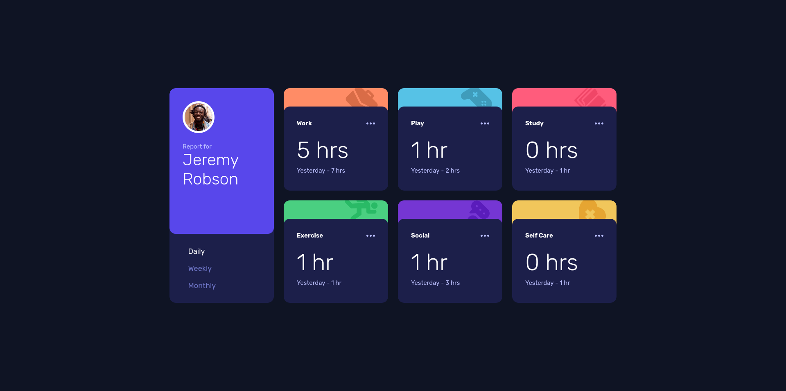
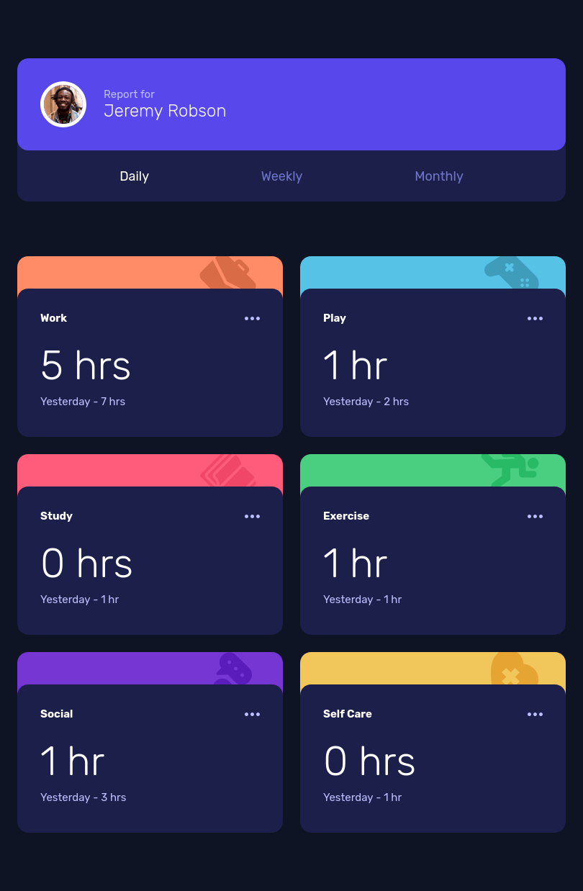
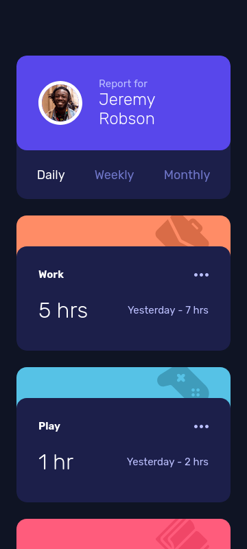

# Frontend Mentor - Time tracking dashboard solution

This is a solution to
the [Time tracking dashboard challenge on Frontend Mentor](https://www.frontendmentor.io/challenges/time-tracking-dashboard-UIQ7167Jw).
Frontend Mentor challenges help you improve your coding skills by building realistic projects.

## Table of contents

- [Overview](#overview)
    - [The challenge](#the-challenge)
    - [Screenshot](#screenshot)
    - [Links](#links)
- [My process](#my-process)
    - [Built with](#built-with)
    - [What I learned](#what-i-learned)
    - [Continued development](#continued-development)
    - [Useful resources](#useful-resources)
- [Author](#author)

## Overview

### The challenge

Users should be able to:

- [x] View the optimal layout for the site depending on their device's screen size
- [x] See hover states for all interactive elements on the page
- [x] Switch between viewing Daily, Weekly, and Monthly stats

### Screenshot

Desktop View

Tablet View

Mobile View

### Links

- Solution
  URL: [Add solution URL here](https://www.frontendmentor.io/solutions/time-tracking-dashboard-with-react-OSh2PxlFiY)
- Live Site URL: [Add live site URL here](https://abestian.github.io/time-tracking-dashboard-fm/)

## My process

### Built with

- Semantic HTML5 markup
- CSS custom properties
- Flexbox
- CSS Grid
- Mobile-first workflow
- [React](https://reactjs.org/)
- [Vite](https://vite.dev/)
- [SASS Pre-Processor](https://sass-lang.com/)
- [BEM Methodology](https://getbem.com/)

### What I learned

While working on this project I reinforced my basic knowledge of React, which I started learning recently.
I learned how to create and use **components** and how to pass values between them using **props**.
I've also used **hooks**, but it's still a concept I'm trying to wrap my head around.

### Continued development

In future projects I'm definitely going to keep on using React to become a fluent user of this framework. I'm also going
to try and use Vite full potential, because for now I only used it as a quick React project starter, but I know that it
can be used for so much more.

### Useful resources

- [Fetching data from a file in React](https://www.pluralsight.com/resources/blog/guides/fetch-data-from-a-json-file-in-a-react-app) -
  This article helped me to work with data provided in `data.json` file.

## Author

- Github - [Abestian](https://github.com/Abestian)
- Frontend Mentor - [@Abestian](https://www.frontendmentor.io/profile/Abestian)
